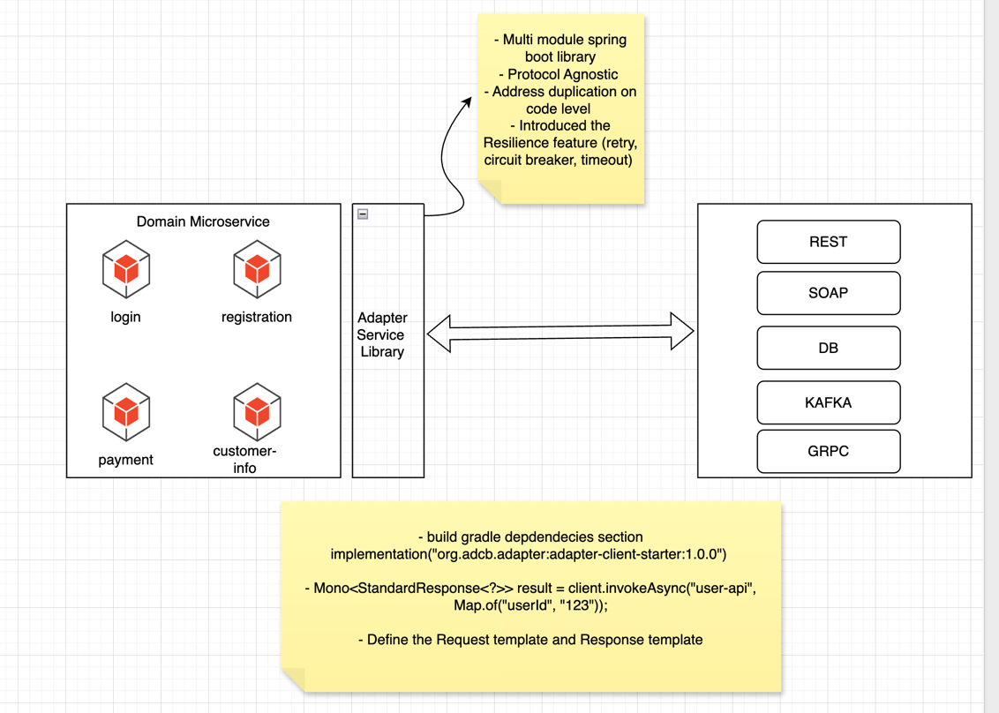

# Microservices Adapter Platform

---

## What is this Project?

The Microservices Adapter Platform is a modular Java backend integration framework for building robust, scalable microservice architectures.  
It provides a central adapter layer and starter library for communication with REST, SOAP, and proxy services—enabling standardized error handling, flexible protocol orchestration, centralized configuration, and rapid extension with new protocols.

---

## Why Was It Introduced?

- **Standardization:** Microservices at scale suffer from divergent error handling, security implementations, and protocol differences. This adapter enforces a single contract and response shape for all communications.
- **Plug-and-play Extensibility:** Teams need to add, swap, or upgrade downstream integration protocols (REST, SOAP, gRPC, proxy, etc.) without refactoring their core business logic.
- **Centralized Cross-cutting Management:** Logging, authentication, error cataloging, and transformations are managed centrally.
- **Rapid Onboarding:** New or existing microservices can simply add a single dependency and start integrating with diverse backend APIs using the same `invoke` method.
- **Proxy/Pass-through Support:** Easily build microservices acting as direct HTTP proxies without transformation/normalization logic.


---

## How Does It Work?

- Microservices include the **adapter-client-starter** dependency.
- All downstream calls use the unified `AdapterGatewayClient` API.
- Service endpoints/protocols (REST/JSON, SOAP, PROXY_PASS, etc.) are configured in YAML.
- The adapter-gateway orchestrates requests, dispatches to the right handler, manages error/logging/security, and normalizes responses.
- Each protocol handler implements a SPI for adding new protocols as needed.

---

## Project Structure


---

## Modules

| Module                    | Description                                                          |
|---------------------------|----------------------------------------------------------------------|
| adapter-client-starter    | Spring Boot starter for consumer microservices (main entry API)      |
| adapter-gateway-service   | Central orchestration and protocol router                            |
| adapter-protocol-rest     | Handles REST/JSON endpoint calls                                     |
| adapter-protocol-soap     | Handles SOAP XML endpoint calls                                      |
| adapter-protocol-proxy    | Direct HTTP proxy/pass-through calls                                 |
| adapter-commons           | Shared DTOs, POJOs, utility classes                                 |
| adapter-spi               | SPI for protocol handler registration                                |
| adapter-transform-core    | Mapping and transformation (pending)                                 |
| adapter-config-service    | Centralized service configuration (optional/pending)                 |
| adapter-security          | Security/auth logic (optional/pending)                               |

---

---

### Individual Module Details

#### 1. adapter-client-starter
- **Purpose:** Provides the main API for microservices (`AdapterGatewayClient`). Auto-configures all dependencies and adapters via Spring Boot.
- **How it works:** Microservices just inject and invoke `AdapterGatewayClient`.

#### 2. adapter-gateway-service
- **Purpose:** Central orchestrator. Reads config (`ServiceMetadata`), dispatches to correct protocol handler, handles errors/logs/security.
- **How it works:** Bootstrapped as either part of starter or as a standalone Spring Boot microservice.

#### 3. adapter-protocol-rest
- **Purpose:** Handles REST/JSON service calls using Spring WebClient.
- **How it works:** Accepts configs, request bodies, and returns normalized response objects.

#### 4. adapter-protocol-soap
- **Purpose:** Handles SOAP service calls using Spring Web Services.
- **How it works:** Manages XML request/response, fault handling, and templates.

#### 5. adapter-protocol-proxy
- **Purpose:** Direct HTTP proxy/pass-through. Forwards requests and bodies as-is.
- **How it works:** No transformation or normalization performed. Returns raw downstream responses.

#### 6. adapter-commons
- **Purpose:** DTOs, error objects, utility classes, core response models shared across modules.

#### 7. adapter-spi
- **Purpose:** Service Provider Interface for protocol handlers.
- **How it works:** Easily add new protocol modules by implementing `ProtocolHandler` SPI and registering as Spring bean.

#### 8. adapter-transform-core *(pending)*
- **Purpose:** Centralized transformation & mapping for request/response data, templates, and conversions.

#### 9. adapter-config-service *(optional, pending)*
- **Purpose:** Externalizes adapter config; supports dynamic endpoint and protocol updates.

#### 10. adapter-security *(optional, pending)*
- **Purpose:** Handles authentication, authorization, and security filtering at adapter layer.

---

## How Microservices Consume the Adapter (as Dependency)

1. **Add Dependency:**
    - In your microservice’s `build.gradle.kts`:
        ```
        dependencies {
            implementation("org.adcb.adapter:adapter-client-starter:1.0.0")
        }
        ```
2. **Configure Services:**
    - In `application.yml`:
        ```
        adapter:
          services:
            rest_service:
              protocol: REST_JSON
              endpointUrl: https://api.example.com/resource
              httpMethod: POST
              headers:
                Authorization: Bearer xyz
            soap_service:
              protocol: SOAP
              endpointUrl: https://soap.example.com/service
              httpMethod: POST
            proxy_service:
              protocol: PROXY_PASS
              endpointUrl: http://other-service/api/direct
              httpMethod: GET
        ```

3. **Use in Code:**
    ```
    @Autowired
    AdapterGatewayClient adapterGatewayClient;

    // REST
    StandardResponse<?> restResult = adapterGatewayClient.invoke("rest_service", Map.of("id", "123"));

    // SOAP
    StandardResponse<?> soapResult = adapterGatewayClient.invoke("soap_service", "<soapRequest>...</soapRequest>");

    // Proxy/pass-through
    String proxyResp = (String) adapterGatewayClient.invoke("proxy_service", payloadObject);
    ```

---

## How to Spin Up Adapter Gateway as an Independent Service

- The **adapter-gateway-service** can run as a standalone Spring Boot application (for enterprise cases, API aggregation, security, etc.)
    1. Build the module:
        ```
        ./gradlew :adapter-gateway-service:bootJar
        ```
    2. Run as a Spring Boot app:
        ```
        java -jar adapter-gateway-service/build/libs/adapter-gateway-service-1.0.0.jar
        ```
    3. Point all microservices’ adapter config to the gateway endpoint.

---

## Testing

- **Unit Tests:** Each protocol handler and utility class is covered by JUnit 5 + Mockito tests.
- **Integration Tests:** Gateway service supports Spring Boot and WebClient/WebServiceTemplate tests with WireMock, MockWebServiceServer.
- **End-to-End:** Run client-starter in a sample microservice with mock endpoints (REST, SOAP, Proxy) to validate flow and error normalization.

**Test Command**:


## Features

- Unified API for all backend protocols
- Central error/logging/security handling
- Protocol-agnostic microservice integration
- Fully configurable and extensible (just implement new ProtocolHandler)
- Support for REST, SOAP, Proxy/Pass-through endpoints
- Response normalization (customizable)

---

## Installation

1. Clone or fork the repository.
2. Build multi-module project using Gradle:
    ```
    ./gradlew clean build
    ```
3. Add `adapter-client-starter` as dependency to your microservice.

---

## Configuration

Define services/protocols in your microservice `application.yml`:


---

## Implementation Status

### ✅ Completed
- `adapter-client-starter`
- `adapter-gateway-service`
- `adapter-commons`
- `adapter-spi`
- `adapter-protocol-rest`
- `adapter-protocol-soap`
- `adapter-protocol-proxy`

### ⏳ Pending / Optional
- `adapter-transform-core` (response/object mapping)
- `adapter-config-service` (externalized/dynamic config)
- `adapter-security` (adapter-layer security and authn/z)
- Expanded protocol support (gRPC, JMS, etc.)

---

## Developer Workflow

1. **Add/Customize Endpoint:**  
   Configure in your microservice’s adapter section.
2. **Consume:**  
   Use the auto-wired client gateway API.
3. **Extend:**  
   Add new protocol modules via the SPI.
4. **Test:**  
   Run unit/integration/E2E tests before deployment!
5. **Monitor/Error:**  
   Central logs and errors enable easier troubleshooting.

---

